# AI 기초 과정중심평가 문항집 v2

> **과목:** 인공지능 기초 | **대상:** 고등학교 2학년 | **총 문항:** 33문항
> **버전:** A(정식) / B(학생 대화형) / C(소설형) | **작성일:** 2026-03-25

---

## 1. 평가 개요

### 1.1 4대 핵심 평가 테마

| 테마 | 코드 | 정의 | 핵심 질문 |
|------|:----:|------|-----------|
| **비판적 사고력** | CT | AI의 가능성과 한계를 근거 기반으로 판단하고, 구조적 원인을 분석하는 능력 | "왜 그런가? 정말 그런가?" |
| **개념 이해** | CO | AI 핵심 구성 요소의 정의와 역할을 정확히 설명하는 능력 | "이것은 무엇이고, 왜 필요한가?" |
| **알고리즘 이해** | AL | AI 학습 알고리즘의 단계와 흐름을 절차적으로 설명하는 능력 | "어떤 순서로 작동하는가?" |
| **수학적 이해** | MA | AI 원리의 수학적 기초를 이해하고 직접 계산에 적용하는 능력 | "직접 계산할 수 있는가?" |

### 1.2 문항 구성

| 파트 | 유형 | 문항 수 | 테마 | 비고 |
|------|------|:-------:|------|------|
| A | 빈칸/단답 | 10 | CO, AL | 이미지 + 용어·정의 확인 |
| B | 계산형 | 9 | MA | 이미지 중심, 연습 문제 공개 |
| C | 시각·분석형 | 5 | CO, CT, MA | 매칭, 순서, 그리기+서술 |
| D | 서술형(개별) | 6 | CO, CT, AL | 핵심 키워드 공개 |
| E | 서술형(통합) | 2 | AL, CT | 차시 간 연결 |
| F | 자기 성찰 | 2 | CT | Google Forms |
| | **합계** | **34** | | |

### 1.3 A/B/C 버전 설명

- **A버전 (정식):** 시나리오 없이 문항만 제시. 포멀한 시험 형식.
- **B버전 (학생 대화형):** 같은 반 친구들(하은, 온유, 은하, 윤지, 하임, 현지, 현공)이 수업 내용을 떠올리며 대화하는 상황. 대화 속에서 문제가 자연스럽게 나옴.
- **C버전 (소설형):** AI 220년 역사를 소설처럼 읽으며, 이야기 속에서 문제를 풀어가는 형식.

### 1.4 채점 원칙

- **빈칸/단답:** 정답 또는 허용 답안 일치 시 만점. 중간 점수 없음.
- **계산형:** 풀이 과정 60% + 최종 답 40%. 과정이 맞으면 산술 실수 시 부분 점수.
- **서술형:** 3축 평가 — ① 핵심 키워드 포함(KW) ② 논리적 설명(LG) ③ 적용·확장(AP)
- **채점 키워드 사전 공개:** 모든 서술형 문항의 핵심 키워드는 학생에게 미리 공개됨. 키워드가 빠지면 감점.

---

## 2. 시나리오 설정

### 2.1 B버전 — AI 수업 친구들의 이야기

> 하은, 온유, 은하, 윤지, 하임, 현지, 현공이는 같은 반 친구들입니다. 모두 AI 기초 수업을 듣고 있고, 수업에서 배운 내용을 자주 이야기합니다. 하은이는 "왜?"를 달고 사는 질문왕, 온유는 차분하게 정리하는 스타일, 은하는 직접 해봐야 직성이 풀리는 실험파, 윤지는 수학에 강한 논리파, 하임이는 엉뚱한 비유를 잘 떠올리는 창의파, 현지는 꼼꼼하게 메모하는 기록파, 현공이는 숫자만 보면 눈이 반짝이는 계산파입니다. 이 문항집에서는 친구들의 대화 속에서 문제가 자연스럽게 등장합니다.

### 2.2 C버전 — "어느 수학자의 꿈" — AI 220년사

> 1950년, 비 내리는 영국 맨체스터. 한 수학자가 논문을 씁니다.
> 제목 — *Computing Machinery and Intelligence.*
> 그는 묻습니다. "기계가 생각할 수 있는가?"
> 이 질문 하나가 220년에 걸친 여정의 시작이었습니다.
> 지금부터 당신은 이 여정을 따라갑니다.

---

## 3. Part A: 기본 개념 (빈칸/단답, 10문항 × 2점 = 20점)

### A버전 (정식)

**A-1.** [CO | 1차시]
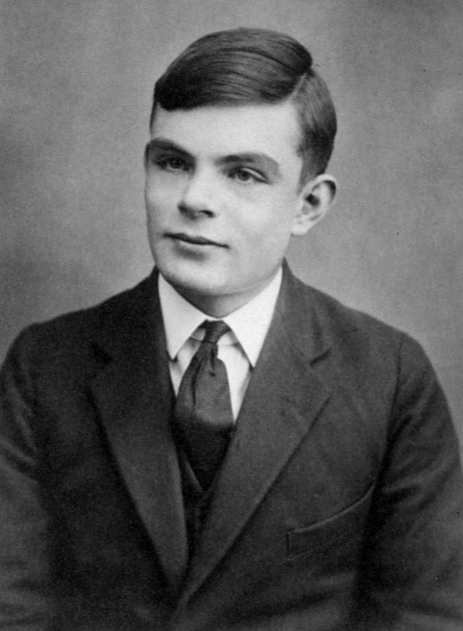
위 사진의 인물은 1950년 "기계가 생각할 수 있는가?"라는 질문을 던진 영국의 수학자이다. 이 사람의 이름은 ( )이다.

**A-2.** [CO | 2차시]

위 사진의 인물은 매컬럭과 핏츠(McCulloch & Pitts)의 인공 뉴런 아이디어에 **학습 규칙**을 더하여 새로운 기계를 만들었다. 이 기계의 이름은 ( )이다.

**A-3.** [CO | 3차시]
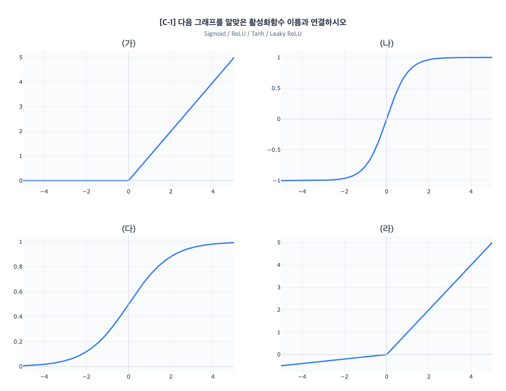
위 그래프 (다) 처럼 출력이 0에서 1 사이의 S자 곡선인 활성화함수의 이름은 ( )이다.

**A-4.** [CO | 3차시]
위 그래프 (가) 처럼 입력이 0 이하이면 0, 양수이면 그대로 출력하는 활성화함수의 이름은 ( )이다.

**A-5.** [CO | 4차시]
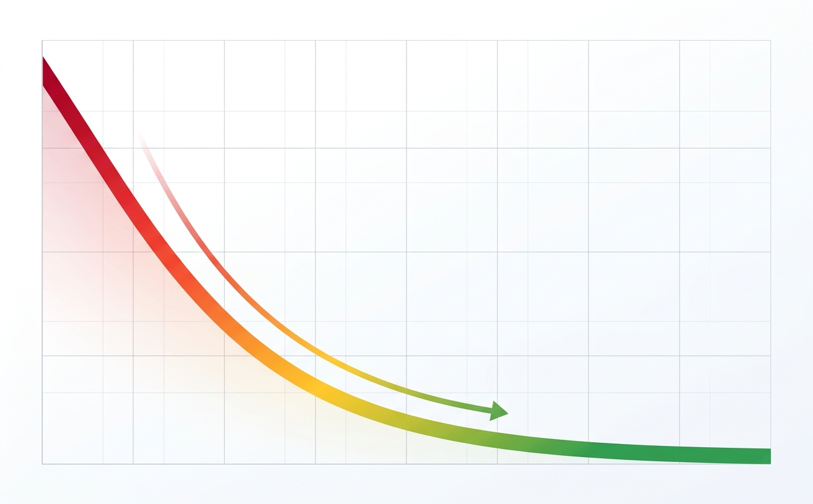
위 그래프처럼, AI가 학습하면서 점점 줄어드는 값이 있다. 예측값과 실제값의 차이를 하나의 숫자로 측정하는 이 함수를 ( )이라 한다.

**A-6.** [CO | 5차시]
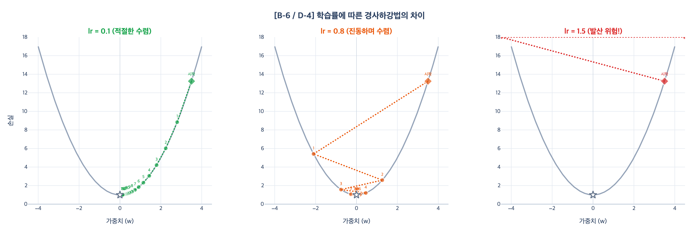
위 그래프에서, 한 번에 이동하는 폭이 너무 크면 발산하고 너무 작으면 느리다. 이 이동 폭을 결정하는 값을 ( )이라 한다.

**A-7.** [AL | 2차시]
퍼셉트론의 학습 규칙은 "예측이 틀리면 가중치를 ( )하고, 맞으면 ( )한다"이다.

**A-8.** [AL | 5차시]
경사하강법의 가중치 업데이트 공식: w_new = w_old − ( ) × ( )

**A-9.** [CO | 7차시]
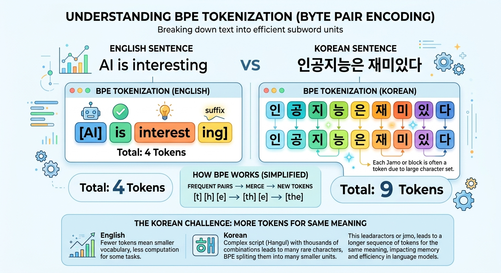
"unhappiness"를 "un", "happi", "ness"처럼 의미 단위로 분절하는 위 그림의 토큰화 방식을 ( )이라 한다.

**A-10.** [CO | 8차시]
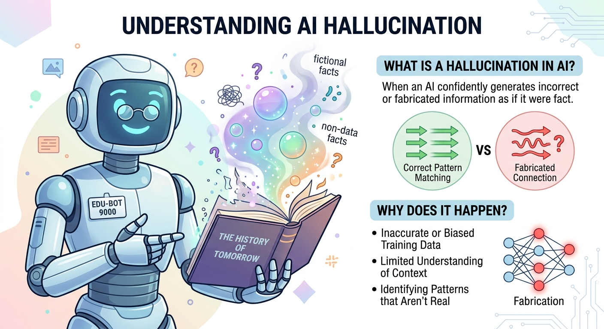
위 그림처럼, AI가 사실이 아닌 내용을 자신 있게 생성하는 현상을 ( )이라 한다.

---

### B버전 (학생 대화형)

**[문제 안내 — A-1]**
하은이와 온유는 1차시 수업이 끝나고 복도에서 이야기하고 있습니다.

> 하은: "오늘 수업에서 본 그 영국 수학자, 1950년에 엄청난 질문을 했잖아."
> 온유: "'기계가 생각할 수 있는가?' 그 질문? 그 사람 이름이..."
> 하은: "사진을 보여줬었는데, 이름이 뭐였더라?"

**[문제]** 위 사진 속 인물의 이름은 ( )이다.

---

**[문제 안내 — A-2]**
윤지와 은하는 교실 벽에 붙어 있는 포스터를 보고 있습니다.

> 윤지: "이 사람이 매컬럭이랑 핏츠의 인공 뉴런에 학습 규칙을 더한 거잖아."
> 은하: "맞아! 근데 이 기계 이름이 뭐였지?"

**[문제]** 위 인물이 만든 학습 기계의 이름은 ( )이다.

---

**[문제 안내 — A-3, A-4]**
점심시간, 현지와 하임이가 활성화함수 그래프를 보며 퀴즈를 내고 있습니다.

> 현지: "자, 이 그래프들 봐. S자 곡선으로 0에서 1 사이 값을 내는 건?"
> 하임: "그건... 음..."
> 현지: "그럼 0 이하면 싹 다 0이고, 양수면 그대로 통과하는 건?"

**[문제]** 그래프 (다)의 활성화함수는 ( )이다. 그래프 (가)의 활성화함수는 ( )이다.

---

**[문제 안내 — A-5, A-6, A-8]**
방과 후 자습 시간, 온유와 하은이가 4~5차시 내용을 복습하고 있습니다.

> 온유: "AI가 학습하면서 이 값이 점점 줄어들잖아."

> 하은: "맞아. 이걸 재는 함수 이름이..."
> 온유: "그리고 줄이려고 이동하는데, 한 번에 얼마나 움직일지를 정하는 값도 있잖아."

> 하은: "공식이 뭐였더라... w_new는..."

**[문제]** 예측값과 실제값의 차이를 측정하는 함수를 ( )이라 한다. 이동 폭을 결정하는 값을 ( )이라 한다. 가중치 업데이트 공식: w_new = w_old − ( ) × ( )

---

**[문제 안내 — A-9, A-10]**
수업 마지막 주, 은하가 ChatGPT를 쓰다가 놀랍니다.

> 은하: "야, ChatGPT한테 물어봤더니 없는 논문을 인용하는 거야!"
> 윤지: "그게 수업에서 배운 그 현상이잖아. 이름이..."

> 은하: "맞다! 그리고 애초에 AI가 글을 쓰려면 단어를 쪼개야 한다고 했잖아."

**[문제]** AI가 사실이 아닌 내용을 생성하는 현상을 ( )이라 한다. 단어를 의미 단위로 분절하는 토큰화 방식을 ( )이라 한다.

---

### C버전 (소설형)

**— 프롤로그: 1950년, 맨체스터 —**

> 비 내리는 오후, 한 영국 수학자가 논문을 씁니다.

> 그는 '기계가 생각할 수 있는가?'라는 질문이 너무 모호하다고 느꼈습니다. 그래서 질문을 바꿉니다. "사람과 기계를 구별할 수 없다면, 그 기계는 생각하는 것인가?" 이 수학자의 이름은 ( **A-1** )이다.

**— 1장: 최초의 학습 기계 (1958) —**

> 프랭크 로젠블랫이 매컬럭-핏츠의 아이디어에 학습 규칙을 더해 기계를 만들었습니다. 이 기계의 이름은 ( **A-2** )입니다. 학습 방법은 단순했습니다 — 예측이 틀리면 값을 ( **A-7a** )하고, 맞으면 ( **A-7b** )합니다.

**— 2장: 스위치 하나의 기적 (1986) —**

> 제프리 힌튼은 혼자 버텼습니다. 그가 발견한 것은 단순한 아이디어 — 각 뉴런에 작은 함수를 넣는 것. 그래프 (다)처럼 0~1 사이 S자 곡선을 그리는 함수는 ( **A-3** )이고, 그래프 (가)처럼 양수를 그대로 통과시키는 함수는 ( **A-4** )입니다.

**— 3장: 별을 찾던 밤 (1801) —**

> 가우스는 관측 오차가 가득한 데이터에서 소행성의 위치를 예측해야 했습니다. "틀린 정도를 숫자로 재자." 이 함수를 ( **A-5** )이라 합니다.

> 코시(1847)는 이 값을 줄이기 위해 기울기의 반대로 이동하라고 제안합니다. 이동 폭을 결정하는 값을 ( **A-6** )이라 하고, 공식은 w_new = w_old − ( **A-8a** ) × ( **A-8b** )입니다.

**— 4장: 단어의 우주 (2013) —**

> 단어를 벡터로 바꾸려면 먼저 텍스트를 쪼개야 합니다. 의미 단위로 분절하는 방식을 ( **A-9** )이라 합니다.

> 2024년, AI가 존재하지 않는 논문을 자신 있게 인용합니다. 이 현상의 이름은 ( **A-10** )입니다.

---

### 정답 및 허용 답안

| 문항 | 정답 | 허용 답안 |
|:----:|------|-----------|
| A-1 | 앨런 튜링 | Alan Turing, 튜링 |
| A-2 | 퍼셉트론 | Perceptron |
| A-3 | 시그모이드 (Sigmoid) | 시그모이드 함수 |
| A-4 | 렐루 (ReLU) | 렐루 함수 |
| A-5 | 손실함수 | 손실 함수, loss function, 비용함수 |
| A-6 | 학습률 | learning rate |
| A-7 | 조정(변경), 유지(그대로 둔다) | 수정/업데이트, 놔둔다/변경하지 않는다 |
| A-8 | 학습률, 기울기(gradient) | lr, 경사, gradient |
| A-9 | BPE | Byte Pair Encoding, 바이트 페어 인코딩 |
| A-10 | 환각 | Hallucination, 할루시네이션 |

---

## 4. Part B: 수학적 이해 (계산형, 9문항)

> **⚠️ 안내:** 아래 연습 문제의 풀이 과정과 정답을 공개합니다. 실제 시험에서는 **숫자만 변경**되며, 난이도는 동일합니다. 풀이 과정을 반드시 쓰세요.

---

### B-1. [MA | 2차시] 퍼셉트론 출력 계산

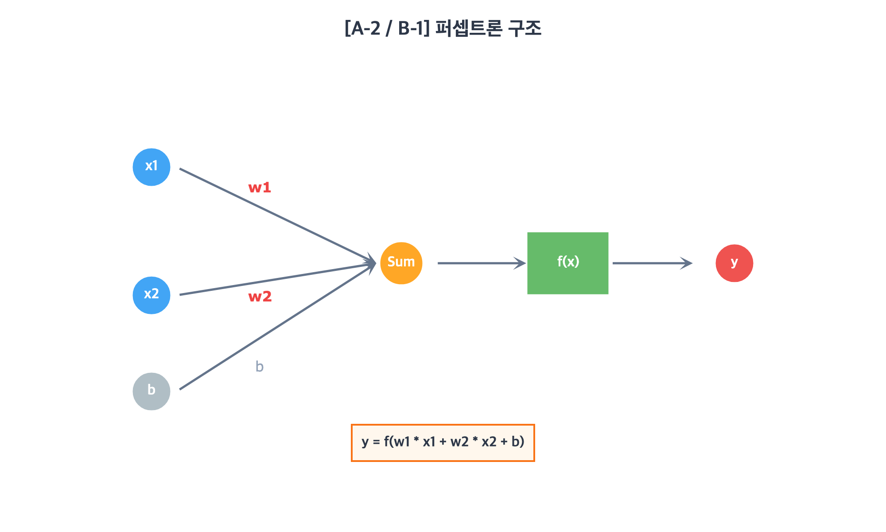

**연습 문제 (공개)**
위 퍼셉트론에서 AND 게이트의 가중치가 w₁=1, w₂=1, 편향 b=−1.5이다. 입력이 (1, 0)일 때, 가중합과 출력을 구하시오. (활성화: 0 초과이면 1, 이하이면 0)

> 풀이: 가중합 = 1×1 + 0×1 + (−1.5) = −0.5 → 0 이하이므로 출력 = **0**

**B버전:**

> [문제 안내]
> 하임이와 현지는 컴퓨터실에서 퍼셉트론 시뮬레이터를 실행하고 있습니다.
>
> 하임: "이 그림 봐. 이게 AND 게이트야."

> 현지: "가중치가 w₁=1, w₂=1이고 편향이 −1.5래. 입력을 (1, 0)으로 넣으면?"
>
> [문제] 가중합과 출력을 구하시오.

**C버전:**

> 1958년, 로젠블랫의 퍼셉트론이 첫 번째 시험을 받습니다.

> AND 게이트 — 가중치 w₁=1, w₂=1, 편향 b=−1.5. 입력 신호 (1, 0)이 들어옵니다. 이 기계는 무엇을 출력할까요?

---

### B-2. [MA | 3차시] 선형 합성 증명

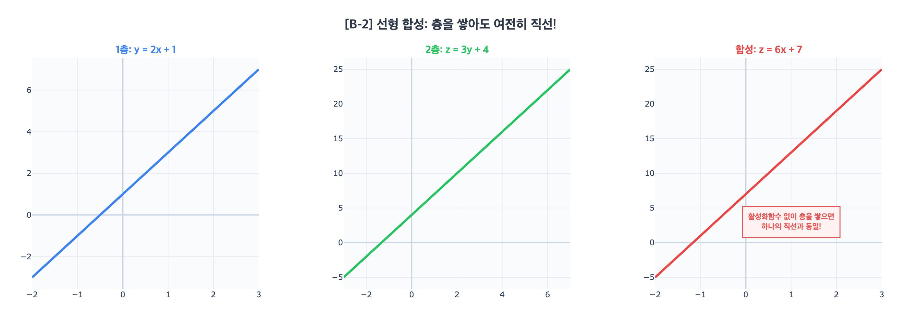

**연습 문제 (공개)**
첫 번째 층이 y = 2x + 1이고, 두 번째 층이 z = 3y + 4일 때, z를 x에 대한 식으로 나타내시오. 이 결과가 의미하는 바를 한 문장으로 쓰시오.

> 풀이: z = 3(2x + 1) + 4 = 6x + 3 + 4 = **6x + 7** (여전히 1차식)
> 의미: 활성화함수 없이 선형 층을 쌓으면, 아무리 많이 쌓아도 하나의 선형 함수와 동일하다.

**B버전:**

> [문제 안내]
> 하은이가 활성화함수 수업을 듣고 궁금해합니다.

> 하은: "선생님이 '활성화함수 없이 층을 쌓으면 의미가 없다'고 했는데, 이 그림이 그 뜻이야?"
> 온유: "직접 계산해보면 바로 알 수 있어."
>
> [문제] y = 2x + 1, z = 3y + 4일 때 z를 x로 나타내고, 의미를 한 문장으로 쓰시오.

---

### B-3. [MA | 4차시] MSE 계산

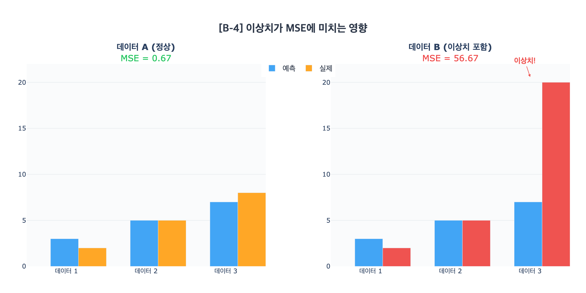

**연습 문제 (공개) — 스토리형**
현공이는 날씨 예측 AI를 만들고 있다. 3일간의 예측 기온이 [4℃, 2℃, 6℃]이고, 실제 기온은 [3℃, 2℃, 9℃]였다. 이 AI의 MSE(평균제곱오차)를 구하시오.

> 풀이:
> 오차: (4−3)=1, (2−2)=0, (6−9)=−3
> 오차 제곱: 1²=1, 0²=0, (−3)²=9
> 합: 1+0+9 = 10
> MSE = 10/3 ≈ **3.33**

**B버전:**

> [문제 안내]
> 현공이가 날씨 예측 프로젝트에서 AI의 성능을 확인하고 있습니다.
>
> 현공: "우리 AI가 3일간 기온을 예측했어. 얼마나 틀렸는지 MSE로 계산해보자."
> 은하: "오차를 제곱하고 평균 내면 되는 거지?"

> [문제] 예측 [4℃, 2℃, 6℃], 실제 [3℃, 2℃, 9℃]일 때 MSE를 구하시오.

---

### B-4. [MA | 4차시] 이상치와 MSE

**연습 문제 (공개)**
데이터 A: 예측 [3, 5, 7], 실제 [2, 5, 8]
데이터 B: 예측 [3, 5, 7], 실제 [2, 5, **20**] (이상치)
A와 B 각각의 MSE를 구하고, 이상치가 MSE에 미치는 영향을 설명하시오.

> 풀이:
> A: [(1)²+(0)²+(−1)²]/3 = 2/3 ≈ **0.67**
> B: [(1)²+(0)²+(−13)²]/3 = 170/3 ≈ **56.67**
> 이상치 하나로 MSE가 약 85배 커졌다. MSE는 오차를 제곱하므로 큰 오차에 민감하다.

**B버전:**

> [문제 안내]
> 현공이가 시뮬레이터에서 직선 피팅을 하다가 이상한 점을 발견합니다.

> 현공: "위 그래프를 봐. 데이터 하나가 엄청 벗어나 있어. 제곱이니까 MSE에 영향이 클 것 같은데..."
> 은하: "얼마나 차이 나는지 직접 계산해보자!"

---

### B-5. [MA | 5차시] 가중치 업데이트

**연습 문제 (공개) — 스토리형**
은하는 경사하강법 레이싱 게임을 하고 있다. 현재 가중치 w = 3.0인 위치에 공이 있고, 그 지점의 기울기 = 4, 학습률 = 0.05일 때, 한 번 업데이트하면 공은 어디로 이동하는가?

> 풀이: w_new = 3.0 − 0.05 × 4 = 3.0 − 0.2 = **2.8**

**B버전:**

> [문제 안내]
> 은하가 경사하강법 레이싱 게임을 하고 있습니다.

> 은하: "지금 내 공이 w=3.0에 있어. 기울기가 4이고 학습률이 0.05면, 한 번 이동하면 어디로 가지?"
> 현공: "공식에 대입해봐!"
>
> [문제] 업데이트된 가중치를 구하시오.

---

### B-6. [MA + CT | 5차시] 학습률 비교

**연습 문제 (공개)**
현재 w = 5.0, 기울기 = −3일 때, 학습률 0.1 / 0.5 / 2.0 각각의 새 가중치를 구하고, 어느 학습률이 가장 적절한지 이유와 함께 쓰시오.

> 풀이:
> lr=0.1: 5.0 − 0.1×(−3) = 5.0 + 0.3 = **5.3** (안정적 이동)
> lr=0.5: 5.0 − 0.5×(−3) = 5.0 + 1.5 = **6.5** (큰 이동)
> lr=2.0: 5.0 − 2.0×(−3) = 5.0 + 6.0 = **11.0** (과도한 이동, 발산 위험)
> 적절한 학습률: 0.1 또는 0.5. 2.0은 최솟값을 뛰어넘어 발산할 수 있다.

**B버전:**

> [문제 안내]
> 현지와 현공이가 경사하강법 레이싱 시뮬레이션을 하고 있습니다.

> 현지: "학습률을 크게 하면 빨리 도착하는 거 아니야?"
> 현공: "위 그래프를 봐. 세 가지 학습률로 비교해볼까?"
>
> [문제] w=5.0, 기울기=−3일 때, lr 0.1/0.5/2.0 각각의 결과와 적절한 학습률을 쓰시오.

---

### B-7. [MA | 6차시] 순전파 계산

**연습 문제 (공개) — 스토리형**
윤지는 간단한 신경망에 데이터를 통과시키는 순전파를 직접 계산해보기로 했다.

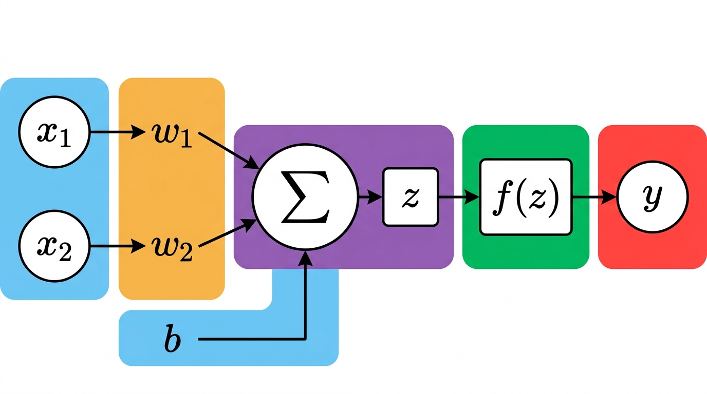

입력 x₁=2, x₂=1, 가중치 w₁=0.5, w₂=−1, 편향 b=0.5, 활성화함수 ReLU일 때 출력을 구하시오.

> 풀이:
> 가중합: z = (2×0.5) + (1×−1) + 0.5 = 1 − 1 + 0.5 = **0.5**
> ReLU(0.5) = **0.5** (양수이므로 그대로)

**B버전:**

> [문제 안내]
> 윤지가 순전파를 종이에서 직접 계산하고 있습니다.

> 윤지: "입력이 2랑 1이고, 가중치가 0.5랑 −1... 이걸 계산하면?"
> 하은: "편향 0.5도 더해야 해! 그리고 ReLU 통과시켜야지."
>
> [문제] 가중합과 ReLU 출력을 구하시오.

---

### B-8. [MA | 2~3차시] 파라미터 수 계산

**연습 문제 (공개)**
다음 신경망의 학습 가능한 파라미터(가중치 + 편향)의 총 개수를 구하시오.

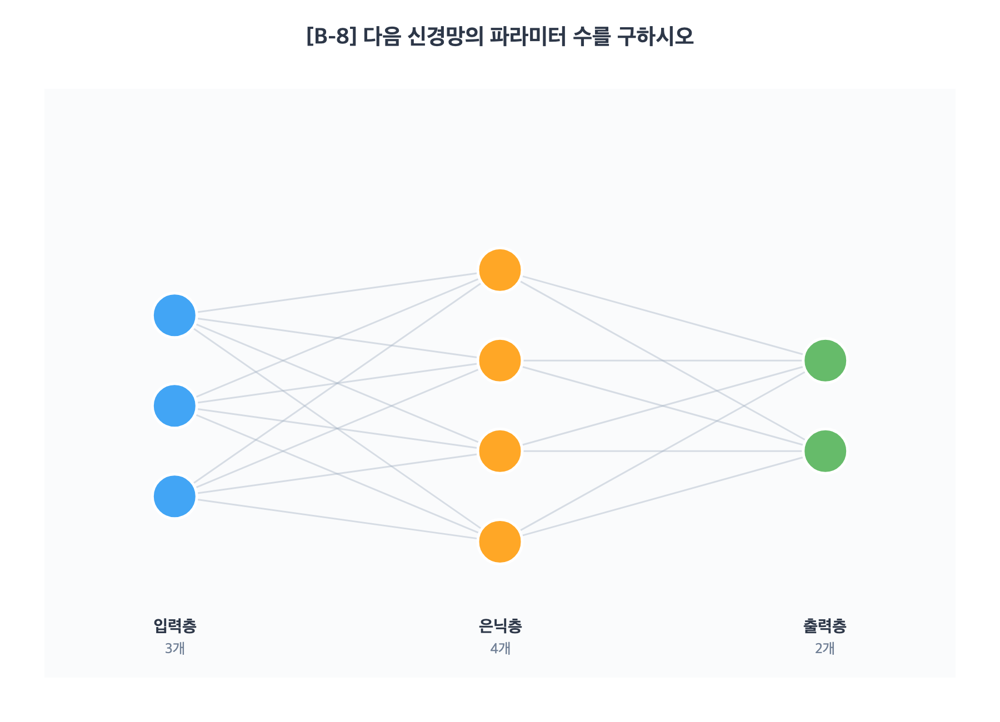

> 풀이:
> 입력→은닉: 가중치 3×4=12개, 편향 4개 → 소계 16개
> 은닉→출력: 가중치 4×2=8개, 편향 2개 → 소계 10개
> **총 26개**

**B버전:**

> [문제 안내]
> 은하와 현공이는 강의실 앞에 있는 뉴럴 네트워크 이미지를 보고 있습니다.

> 은하: "어? 이것도 뉴럴 네트워크네?"
> 현공: "맞아. 그러면 여기엔 학습할 가중치와 편향이 모두 몇 개지?"
> 은하: "어.. 잠깐.. 층마다 세야 하는 거지?"
>
> [문제] 위 신경망에서 학습할 파라미터는 총 몇 개인가?

**C버전:**

> 수업에서, 화면 속 뉴런을 추가할 때마다 파라미터 카운터가 올라갔습니다.

> "GPT-4는 파라미터가 수천억 개입니다." 위 신경망에서 학습해야 할 파라미터는 정확히 몇 개인가?

---

### B-9. [MA | 7차시] 워드벡터 산술

**연습 문제 (공개) — 스토리형**
하임이는 Word2Vec 수업에서 "단어의 의미가 벡터 연산으로 표현된다"는 것에 감동받았다.

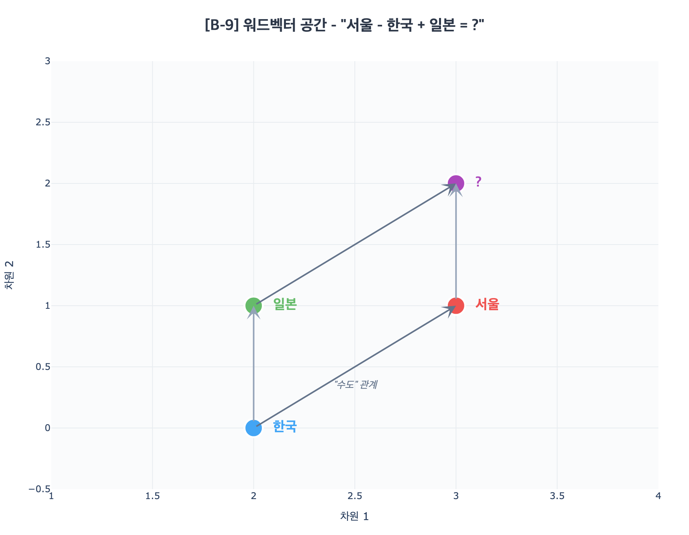

서울=[3, 1], 한국=[2, 0], 일본=[2, 1]일 때, "서울 − 한국 + 일본"을 계산하고, 이 결과가 의미하는 바를 한 문장으로 쓰시오.

> 풀이: [3−2+2, 1−0+1] = **[3, 2]**
> 의미: "서울이 한국의 수도이듯, 결과 벡터는 일본의 수도(도쿄)에 해당하는 위치를 가리킨다."

**B버전:**

> [문제 안내]
> 하임이가 워드벡터 실험에서 감탄합니다.

> 하임: "대박! 왕 − 남자 + 여자 = 여왕이래. 그러면 서울 − 한국 + 일본은?"
> 현공: "위 그래프를 보고 벡터 연산을 해보자."
>
> [문제] 서울=[3,1], 한국=[2,0], 일본=[2,1]일 때 계산 결과와 의미를 쓰시오.

---

### 계산형 채점 기준 (공통)

| 단계 | 배점 비율 | 기준 |
|------|:---------:|------|
| 공식/방법 제시 | 20% | 올바른 공식을 기록 |
| 풀이 과정 | 40% | 각 단계의 계산이 정확 |
| 최종 답 | 40% | 정답 도출 |
| **carried error** | — | 앞 단계 실수가 뒷 단계에 영향 시, 뒷 단계 논리가 맞으면 해당 단계 점수 부여 |

---

## 5. Part C: 시각·분석형 (5문항, 16점)

### C-1. [CO | 3차시] 활성화함수 그래프 매칭 (2점)

**A버전:** 위 4개의 그래프를 알맞은 활성화함수 이름과 연결하시오.
(Sigmoid / ReLU / Tanh / Leaky ReLU)

**B버전:**

> [문제 안내]
> 온유가 시험 공부를 하다가 그래프 4개를 펼쳐놓습니다.
>
> 온유: "이 그래프들이 다 다른데, 어떤 게 어떤 함수인지 헷갈려..."
> 윤지: "하나씩 특징을 보면 돼. S자는? 꺾인 선은? 음수 쪽도 작은 값이 나오는 건?"

**C버전:**
> 힌튼의 연구실 벽에는 4개의 그래프가 나란히 붙어 있었습니다. 각각의 곡선이 신경망에 서로 다른 성격을 부여합니다. 어떤 곡선이 어떤 함수인가?

**정답:** (가)=ReLU, (나)=Tanh, (다)=Sigmoid, (라)=Leaky ReLU
**채점:** 4개 모두 정확 2점, 3개 1점, 2개 이하 0점

---

### C-2. [AL | 6차시] 역전파 4단계 순서 배열 (2점)

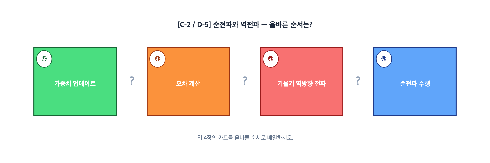

**A버전:** 다음을 역전파 과정의 올바른 순서로 배열하시오.
`[ 가중치 업데이트 / 순전파 수행 / 기울기 역방향 전파 / 오차 계산 ]`

**B버전:**

> [문제 안내]
> 하임이가 역전파 4단계를 카드로 만들어 섞습니다.
>
> 하임: "이 4장을 순서대로 놓아봐."
> 현지: "순전파가 먼저인 건 알겠는데, 그 다음이..."

**정답:** 순전파 수행 → 오차 계산 → 기울기 역방향 전파 → 가중치 업데이트

---

### C-3. [MA + CO | 3차시] ReLU 그래프 그리기 + 서술 (4점)

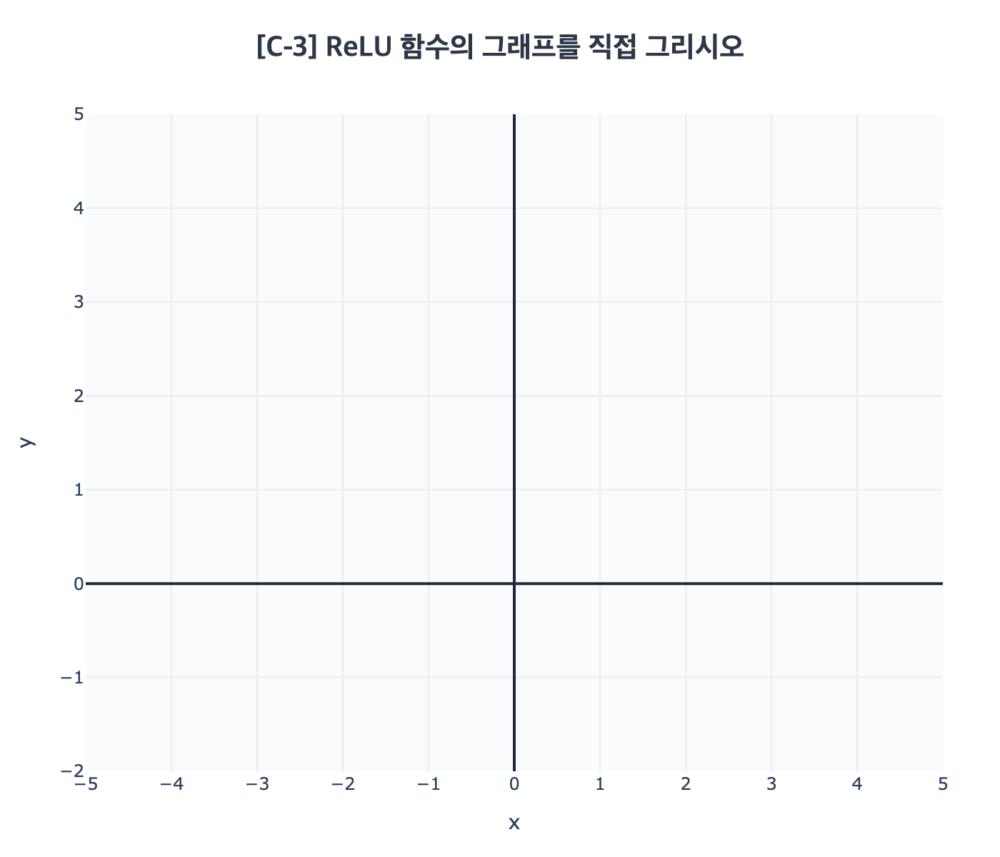

**A버전:**
(1) 위 좌표평면에 ReLU 함수의 그래프를 직접 그리시오. (2점)
(2) 10층 이상의 깊은 신경망에서, Sigmoid 대신 ReLU를 사용하는 이유를 '기울기 소실' 관점에서 설명하시오. (2점)

**B버전:**

> [문제 안내]
> 하은이가 활성화함수 비교표를 보며 고민합니다.
>
> 하은: "ReLU 그래프를 직접 그려볼래?"
> 윤지: "좋아. 그런데 왜 딥러닝에서는 Sigmoid 대신 ReLU를 쓰는 거야? 선생님이 '기울기 소실'이라고 했는데..."

**📌 핵심 키워드 (공개):** 기울기 소실, Sigmoid 기울기 0, ReLU 기울기 1, 깊은 신경망

**교사용 정답:**
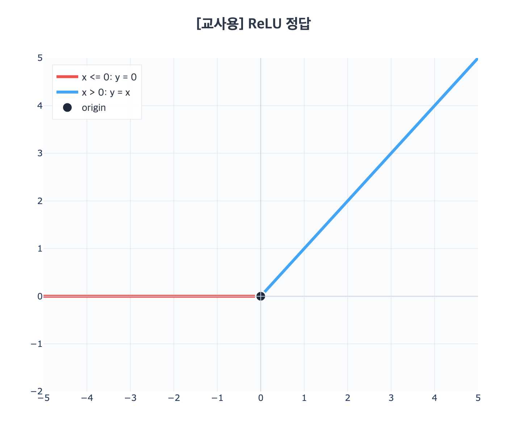

---

### C-4. [CO + AL | 3차시] 활성화함수가 필요한 이유 (4점)

**A버전:**
위 그래프를 참고하여, 다층 신경망에서 활성화함수 없이 층을 쌓으면 왜 의미가 없는지 설명하고, 활성화함수가 부여하는 핵심 성질의 이름을 쓰시오.

**B버전:**

> [문제 안내]
> 윤지가 수업에서 본 실험 결과를 보며 생각합니다.

> 윤지: "이 그래프 봐. 두 개의 선형 함수를 합성해도 결국 직선이야."
> 온유: "그러면 층을 100개 쌓아도 의미가 없다는 거잖아. 이걸 해결하는 게..."
>
> [문제] 활성화함수 없이 층을 쌓으면 왜 의미가 없는지 설명하고, 활성화함수가 부여하는 핵심 성질을 쓰시오.

**📌 핵심 키워드 (공개):** 선형 함수 합성 = 선형, 비선형성, 공간 변환
**정답 키워드:** 비선형성 (non-linearity)

---

### C-5. [CO + MA | 2차시] 좌표평면 분석 (4점)

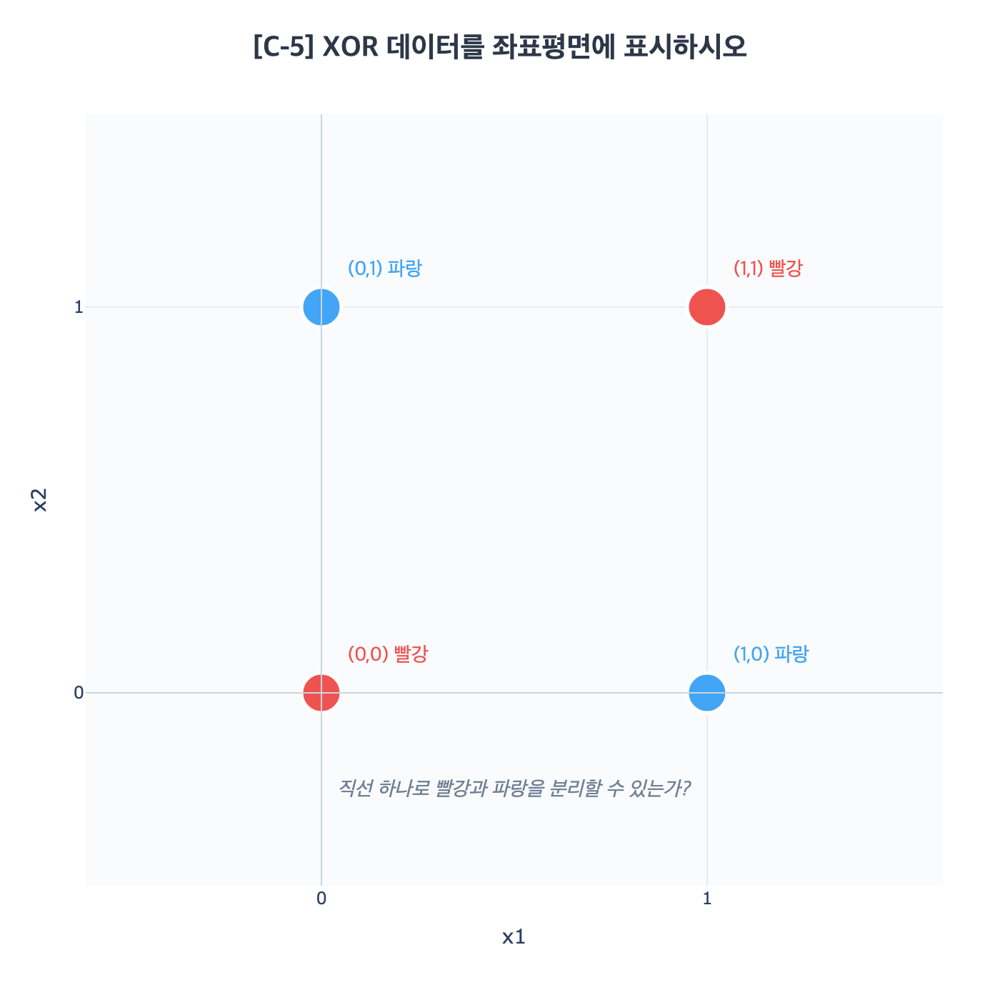

**A버전:**
(1) 위 좌표평면의 XOR 데이터를 확인하시오: (0,0)=빨강, (0,1)=파랑, (1,0)=파랑, (1,1)=빨강. (1점)
(2) 직선 하나로 빨강과 파랑을 완전히 분리할 수 있는지 판단하고, 그 이유를 쓰시오. (3점)

**B버전:**

> [문제 안내]
> 현지와 하임이가 2차시에서 했던 XOR 실험을 다시 떠올립니다.

> 현지: "위 그래프를 봐. 아무리 직선을 움직여도 빨강이랑 파랑을 나눌 수 없었잖아."
> 하임: "왜 안 되는지 설명해볼까?"

---

## 6. Part D: 서술형 — 개별 주제 (6문항 × 4점 = 24점)

> 📌 모든 서술형 문항의 **핵심 키워드**와 **채점 기준**은 사전 공개됩니다. 키워드가 빠지면 감점입니다.

---

### D-1. [CT | 1차시] 튜링 테스트 vs 중국어 방 — 기계는 생각하는가?

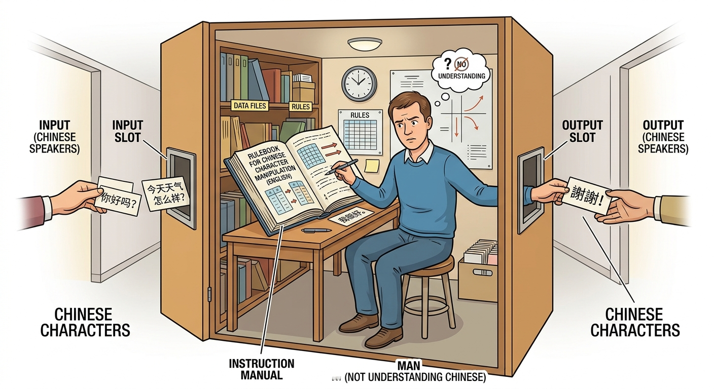

**A버전:**
튜링 테스트의 판정 기준과 중국어 방 반박을 각각 설명하고, 현재의 ChatGPT에 대해 자신의 의견을 근거와 함께 쓰시오.

**B버전:**

> [문제 안내]
> 하은이와 하임이가 1차시 수업 후 토론을 하고 있습니다.
>
> 하은: "나는 ChatGPT가 생각할 수 있다고 봐. 대화가 너무 자연스러웠잖아."
> 하임: "근데 중국어 방 실험을 생각하면... 이해하는 게 아니라 흉내 아닌가?"
> 하은: "흠... 너는 어떻게 생각해? 근거를 들어서 말해봐."

**C버전:**

> 1950년, 튜링은 말합니다. "구별할 수 없다면, 생각하는 것이다." 1980년, 설은 반박합니다. "중국어를 모르는 사람이 매뉴얼만 보고 대화한다면, 이해하는 것인가?" 2024년 현재, ChatGPT는 자연스러운 대화를 합니다. 튜링 테스트의 기준과 중국어 방의 반박을 각각 설명하고, ChatGPT에 대한 당신의 판단을 근거와 함께 쓰시오.

**📌 핵심 키워드:** 튜링 테스트, 중국어 방, 구별 불가 = 지능, 이해 vs 흉내

**📊 5단계 루브릭**

| 점수 | 기준 |
|:----:|------|
| 5 | 튜링 테스트·중국어 방 **양쪽 모두** 정확 설명 + ChatGPT에 대해 **근거 2개 이상** 자기 입장 |
| 4 | 양쪽 설명 정확 + 자기 입장은 있으나 근거 **1개** |
| 3 | 한쪽만 정확하거나 양쪽 모두 부분적 + 자기 입장 있음 |
| 2 | 두 개념 구분 모호, 자기 입장 근거 없음 |
| 1 | 무응답 또는 주제 무관 |

**✅ 5점 예시 답안:**
> 튜링 테스트는 "기계의 응답을 사람과 구별할 수 없다면 그 기계에 지능이 있다"는 판정 기준이다. 반면 중국어 방은, 매뉴얼을 따라 올바른 답을 내놓아도 그것은 '이해'가 아니라 '흉내'라고 반박한다. ChatGPT는 자연스러운 대화가 가능하므로 튜링 테스트 기준에서는 지능이 있다고 볼 수 있으나, 나는 중국어 방의 입장에 더 동의한다. ChatGPT는 확률적으로 다음 토큰을 예측할 뿐 문장의 의미를 이해하지 않으며, 이는 환각 현상에서 드러난다.

---

### D-2. [CO + CT | 2+3차시] XOR 한계와 활성화함수

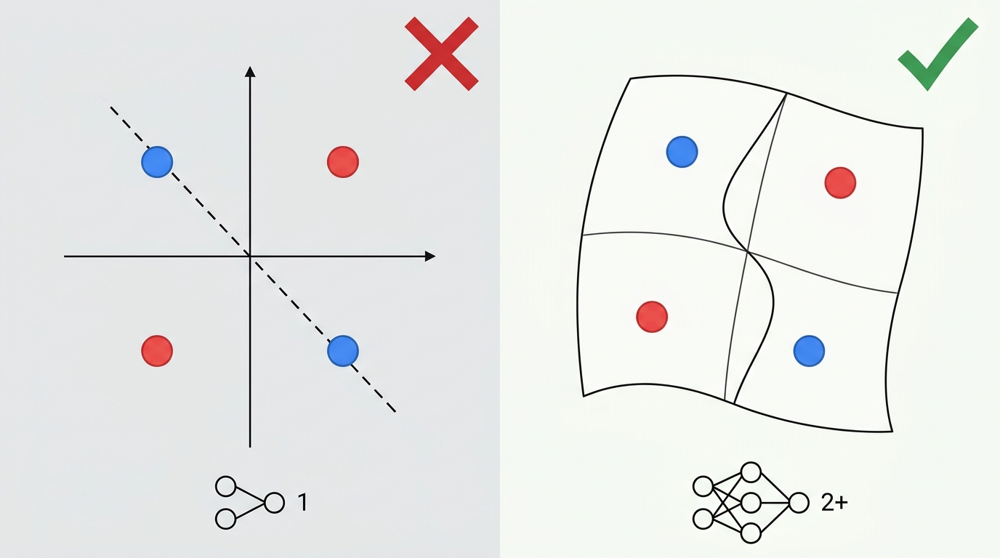

**A버전:**
단층 퍼셉트론이 XOR 문제를 풀 수 없는 이유를 설명하고, 활성화함수가 이 한계를 어떻게 극복하는지 서술하시오.

**B버전:**

> [문제 안내]
> 은하가 2차시의 좌절을 떠올립니다.
>
> 은하: "아직도 기억나. 직선을 아무리 움직여도 XOR이 안 됐잖아."
> 온유: "맞아. 근데 3차시에서 활성화함수 켜니까 됐잖아. 왜 그런 건지 설명할 수 있어?"
> 은하: "음... 직선 하나로 안 되니까... 공간을 구부린다고 했나?"

**📌 핵심 키워드:** 직선 분리 불가, 대각선 배치, 비선형성, 공간 변환, 다층 신경망

**📊 5단계 루브릭**

| 점수 | 기준 |
|:----:|------|
| 5 | XOR이 직선으로 분리 불가한 이유를 좌표 기반으로 설명 + 활성화함수의 비선형 공간 변환 원리 연결 |
| 4 | 두 부분 모두 언급했으나 한쪽 설명 약간 불완전 |
| 3 | XOR 한계 OR 활성화함수 역할 중 하나만 정확히 설명 |
| 2 | 두 개념을 단편적으로만 언급 |
| 1 | 무응답 또는 주제 무관 |

---

### D-3. [CO | 4차시] 손실함수는 무엇이고, 왜 필요한가?

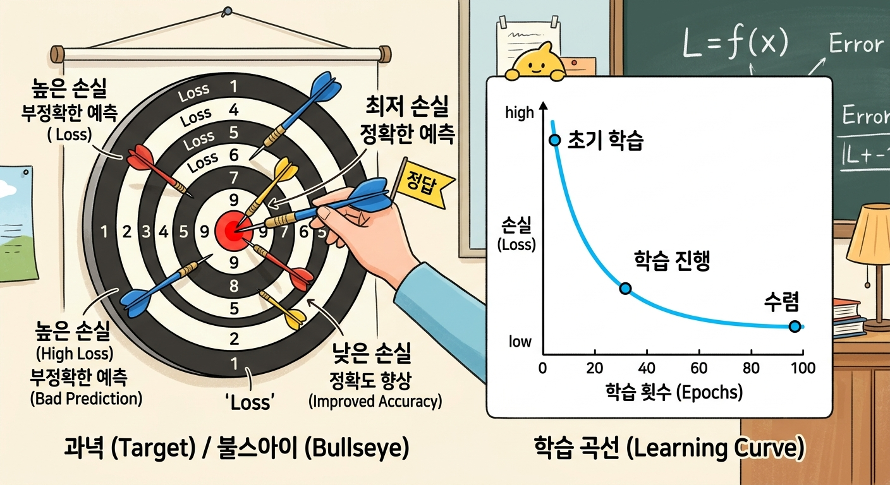

**A버전:**
손실함수의 정의와 신경망 학습에서의 역할을 설명하시오.

**B버전:**

> [문제 안내]
> 윤지가 동생에게 AI를 설명해달라는 부탁을 받습니다.
>
> 윤지: "현지야, 나 동생이 '손실함수가 뭐야?'라고 물어보는데 어떻게 설명하면 좋을까?"
> 현지: "음... '얼마나 틀렸는지를 재는 자'라고 하면 되지 않을까?"
> 윤지: "근데 왜 필요한지도 설명해야 해."

**C버전:**
> 1801년, 가우스는 "틀린 정도를 최소로 만들자"는 아이디어로 소행성 세레스를 찾았습니다. 이 아이디어가 현대 AI에서는 '손실함수'가 되었습니다. 손실함수란 무엇이고, 신경망 학습에서 왜 필요한지 설명하시오.

**📌 핵심 키워드:** 예측값과 실제값의 차이, 수치화, 손실 줄이기 = 학습, MSE

**📊 5단계 루브릭**

| 점수 | 기준 |
|:----:|------|
| 5 | 정의(예측-실제 차이 수치화) + 역할(학습 방향 제시) + 구체적 예시(MSE 또는 비유) |
| 4 | 정의 + 역할 정확, 예시 부족 |
| 3 | 정의 또는 역할 중 하나만 정확 |
| 2 | "틀린 걸 알려준다" 수준의 막연한 서술 |
| 1 | 무응답 또는 오개념 |

**✅ 5점 예시 답안:**
> 손실함수란 모델의 예측값과 실제 정답의 차이를 하나의 숫자로 계산하는 함수이다. 대표적으로 MSE(평균제곱오차)가 있다. 이것이 없으면 모델이 현재 얼마나 잘못 예측하고 있는지 알 수 없고, 가중치를 어느 방향으로 조정해야 하는지도 결정할 수 없다. 즉, 신경망의 학습이란 결국 손실함수 값을 최소화하는 방향으로 가중치를 반복 업데이트하는 과정이다.

**⚠️ 3점 예시 답안:**
> 손실함수는 예측값과 실제값이 얼마나 다른지 나타내는 것이다. 손실이 크면 잘 못한 것이다.

---

### D-4. [CO + CT | 5차시] 경사하강법과 학습률

**A버전:**
경사하강법의 원리를 설명하고, 학습률이 너무 클 때와 너무 작을 때 각각 어떤 문제가 생기는지 서술하시오.

**B버전:**

> [문제 안내]
> 현지가 레이싱 시뮬레이션에서 겪은 일을 떠올립니다.
>
> 현지: "학습률 2.0으로 했더니 공이 왔다 갔다 하면서 안 내려갔어."
> 은하: "나는 0.001로 했더니 너무 느려서 시간 안에 못 내려갔어."
> 현지: "왜 그런 건지 설명해볼까?"

**📌 핵심 키워드:** 기울기 반대 방향, 가중치 업데이트, 과대 → 발산, 과소 → 느린 수렴

---

### D-5. [AL | 6차시] 순전파와 역전파의 관계

**A버전:**
순전파와 역전파의 관계를 4단계로 설명하시오.

**B버전:**

> [문제 안내]
> 시험 전날, 하임이가 핵심 정리를 합니다.
>
> 하임: "역전파가 제일 어려웠어. 순전파랑 뭐가 다른 건지..."
> 하은: "순전파는 앞으로, 역전파는 뒤로 가는 거잖아. 4단계로 정리해볼까?"

**C버전:**
> 1986년, 럼멜하트, 힌튼, 윌리엄스가 발표합니다 — 역전파 알고리즘.

> 오차를 출력층에서 입력층 방향으로 거꾸로 보내며 각 가중치의 책임을 계산하는 방법. 순전파와 역전파가 어떻게 함께 작동하여 신경망을 학습시키는지, 4단계로 설명하시오.

**📌 핵심 키워드:** 순전파(입력→출력), 오차 계산, 기울기 역전파(출력→입력), 가중치 업데이트

**📊 5단계 루브릭**

| 점수 | 기준 |
|:----:|------|
| 5 | 4단계를 올바른 순서로 설명 + 연쇄법칙의 역할까지 언급 |
| 4 | 4단계 순서 정확, 연쇄법칙 미언급 |
| 3 | 순전파→역전파 방향은 이해하나 단계 구분이 불완전 |
| 2 | "앞으로 갔다가 뒤로 간다" 수준의 막연한 서술 |
| 1 | 무응답 또는 순서 오류 |

---

### D-6. [CO | 8차시] 다음 토큰 예측과 Temperature

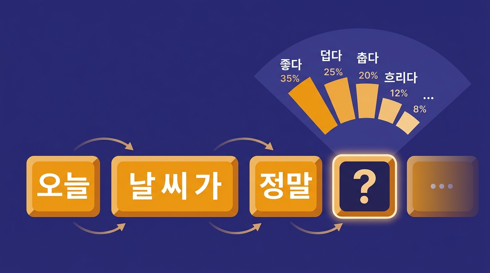
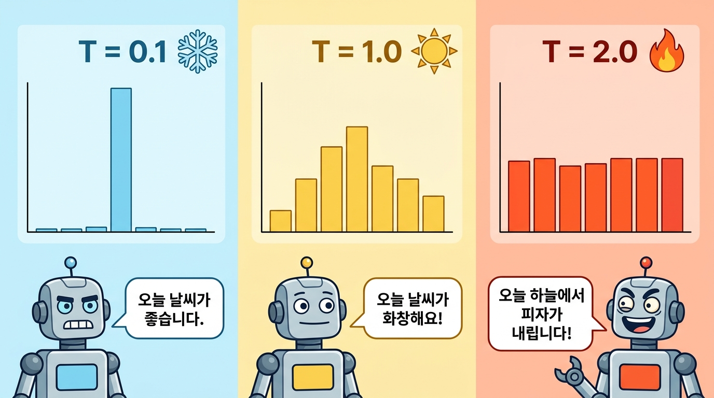

**A버전:**
LLM의 '다음 토큰 예측' 원리를 설명하고, Temperature가 출력에 미치는 영향을 서술하시오.

**B버전:**

> [문제 안내]
> 온유가 Temperature 슬라이더를 조절하며 실험합니다.
>
> 온유: "Temperature를 0.1로 하니까 맨날 같은 답만 나와. 2.0으로 하니까 이상한 말도 해."
> 윤지: "왜 그런 건지 설명할 수 있어? '다음 토큰 예측' 원리부터 시작해서."

**📌 핵심 키워드:** 확률 분포, 다음 토큰 예측, 낮으면 → 반복적, 높으면 → 다양

---

## 7. Part E: 서술형 — 통합 (2문항 × 5점 = 10점)

---

### E-1. [AL | 4+5+6차시] 신경망 학습의 전체 과정

**A버전:**
신경망이 하나의 데이터에서 학습하는 전체 과정을 "손실함수 → 경사하강법 → 역전파"의 흐름으로 연결하여 설명하시오.

**B버전:**

> [문제 안내]
> 윤지가 시험 대비 총정리를 합니다.
>
> 윤지: "4차시, 5차시, 6차시에서 배운 게 결국 하나로 이어지잖아."
> 하은: "맞아. 손실함수로 재고 → 경사하강법으로 줄이고 → 역전파로 전달하는 거지?"
> 윤지: "그 전체 흐름을 처음부터 끝까지 써보자."

**C버전:**
> 가우스(1801)가 발명한 "틀린 정도 재기", 코시(1847)가 제안한 "기울기 반대로 이동", 힌튼(1986)이 되살린 "오차의 역전파" — 이 세 아이디어가 합쳐져 현대 AI의 학습이 완성되었습니다. 이 전체 과정을 하나의 흐름으로 연결하여 설명하시오.

**📌 핵심 키워드:** 순전파→예측, 손실함수→오차 수치화, 경사하강법→기울기 반대 이동, 역전파→기울기 분배, 반복

**📊 5단계 루브릭**

| 점수 | 기준 |
|:----:|------|
| 5 | 3개 개념을 **인과적으로 연결**하여 전체 학습 사이클을 완결적으로 설명 + "반복"까지 |
| 4 | 3개 모두 언급하고 연결했으나 흐름이 약간 불완전 |
| 3 | 2개 개념만 연결하거나, 3개 모두 언급하나 나열식 |
| 2 | 1~2개 개념만 단편적으로 언급 |
| 1 | 무응답 또는 주제 무관 |

---

### E-2. [CT + CO | 7+8차시] 환각의 구조적 원인

**A버전:**
LLM이 환각(거짓 정보)을 생성하는 원인을 토큰화, 확률적 다음 토큰 예측의 관점에서 설명하시오. "AI가 멍청해서"가 아닌, **구조적으로 왜 필연적인지** 서술하시오.

**B버전:**

> [문제 안내]
> 은하가 ChatGPT의 환각 사례를 발견하고 놀랍니다.
>
> 은하: "ChatGPT한테 연구 논문 추천해달라고 했더니, 진짜 없는 논문을 지어냈어!"
> 하임: "그게 환각이잖아. 근데 이거 AI가 바보라서 그런 게 아니라고 했잖아."
> 은하: "맞아... 토큰화부터 시작해서 왜 이럴 수밖에 없는지 설명해볼래?"

**C버전:**
> 2024년, AI가 존재하지 않는 논문 3편을 자신 있게 인용합니다. 사람들은 "AI가 멍청하다"고 말합니다. 하지만 이 수업을 통해 당신은 알고 있습니다 — 이것은 멍청함이 아니라 **구조적 필연**입니다. 토큰화와 확률적 다음 토큰 예측의 관점에서, 환각이 왜 불가피한지 설명하시오.

**📌 핵심 키워드:** 토큰 = 통계적 단위, 확률 기반 예측, "그럴듯한" ≠ "사실인", 사실 검증 불가

**📊 5단계 루브릭**

| 점수 | 기준 |
|:----:|------|
| 5 | 토큰화 + 확률적 예측 + "구조적 필연" 논리가 **인과적으로 연결** |
| 4 | 두 요소를 모두 언급·연결했으나 "왜 필연인지" 약간 부족 |
| 3 | 한 요소만 정확 또는 두 요소 모두 피상적 |
| 2 | "확률로 맞추니까 틀릴 수 있다" 수준 |
| 1 | "AI가 멍청해서" 수준 또는 무응답 |

**✅ 5점 예시 답안:**
> LLM은 텍스트를 토큰 단위로 처리하며, 토큰은 의미가 아닌 통계적 빈도 기반의 분절 단위이다. LLM의 핵심 작동 원리는 이전 토큰들의 맥락에서 "다음에 올 가능성이 가장 높은 토큰"을 확률적으로 선택하는 것이다. 이때 "가장 그럴듯한 다음 단어"가 "사실인 단어"와 같다는 보장이 없다. AI는 학습 데이터의 패턴을 재조합할 뿐, 사실 여부를 검증하는 메커니즘이 없다. 따라서 환각은 AI의 오류가 아니라 확률 기반 생성 구조의 구조적 필연이다.

---

## 8. Part F: 자기 성찰 (Google Forms, 2문항)

### F-1. [CT] Before — 1차시 수업 시작 시 작성

> **"기계가 생각할 수 있는가?"**
>
> 1. 이 질문에 대한 나의 현재 답: (자유 서술)
> 2. 그렇게 생각하는 근거: (자유 서술)
> 3. AI에 대해 내가 이미 알고 있는 것: (자유 서술)
> 4. 이 수업에서 가장 알고 싶은 것: (자유 서술)

### F-2. [CT] After — 10차시 수업 종료 시 작성

> 1. 같은 질문 "기계가 생각할 수 있는가?"에 대한 **지금의** 답: (자유 서술)
> 2. 1차시 때의 나의 답을 다시 읽어보세요. **무엇이 변했나요?** (자유 서술)
> 3. **어떤 수업 경험**이 나의 생각을 바꾸었나요? 가장 결정적이었던 순간을 구체적으로: (자유 서술)
> 4. 수업에서 배운 개념 중 **3개 이상**을 사용하여 답의 근거를 쓰시오: (자유 서술)
> 5. AI와 인간이 함께하는 미래에 대한 나의 생각: (자유 서술)

### 성찰 채점 기준

| 항목 | 배점 | 기준 |
|------|:----:|------|
| Before 작성 성실도 | 2점 | 모든 항목에 자기 생각을 구체적으로 작성(2) / 형식적(1) / 미작성(0) |
| After — 변화 인식 | 3점 | 변화를 구체적 경험과 연결(3) / 변화는 인식하나 근거 모호(2) / 변화 미인식(1) |
| After — 개념 활용 | 3점 | 3개 이상 개념을 정확히 활용(3) / 1~2개(2) / 없음(1) |
| After — 성찰의 진정성 | 2점 | 자기 언어로 솔직하게 서술(2) / 형식적(1) / 미작성(0) |

---

## 9. 교사용 부록

### 9.1 차시별 평가 문장 (생기부 기재 예시문)

---

#### 1차시: 기계가 생각할 수 있는가?

**[상]** 튜링 테스트의 판정 기준과 한계를 정확히 이해하고, 중국어 방 사고실험을 활용하여 '이해'와 '흉내'의 차이를 논리적으로 분석함. 소켓 기반 튜링 테스트 활동에서 말투가 아닌 내용의 본질에 집중하는 판별 전략을 수립하고, AI와 인간의 차이에 대해 근거 있는 자기 견해를 제시함.

**[중]** 튜링 테스트의 기본 개념을 이해하고, 기계 지능의 판별 기준에 대해 자신의 생각을 표현함. 튜링 테스트 게임에 참여하여 AI와 인간의 응답 차이를 관찰하고, 구별이 쉽지 않다는 경험을 통해 AI 지능의 복잡성을 인식함.

**[하]** 튜링 테스트 게임에 참여하여 기계와 인간의 구별이 쉽지 않다는 것을 체험함. AI에 대한 기초적 관심을 가지고, '기계가 생각할 수 있는가'라는 질문에 대해 자신의 첫 생각을 기록함.

---

#### 2차시: 퍼셉트론은 왜 실패했는가?

**[상]** 퍼셉트론의 구조(입력, 가중치, 편향, 활성화)를 정확히 이해하고 가중합을 계산할 수 있으며, 좌표평면에서 AND/OR은 직선으로 분류 가능하나 XOR은 불가능한 이유를 선형 분리의 한계로 도출하여 설명함.

**[중]** 퍼셉트론의 기본 구조를 이해하고, 시뮬레이터에서 AND/OR 분류에 성공하나 XOR이 직선 하나로 불가능하다는 것을 확인함.

**[하]** 퍼셉트론 시뮬레이터에서 AND/OR 분류 활동에 참여하고, XOR 패턴이 직선으로 분리되지 않는 '좌절 경험'을 함.

---

#### 3차시: AI의 겨울을 이겨낸 알고리즘의 발견

**[상]** 다층 신경망에서 활성화함수 없이 층을 쌓으면 단일 선형 변환과 동일해지는 이유를 수학적으로 설명하고, 활성화함수가 비선형성을 부여하여 복잡한 패턴 학습을 가능하게 하는 원리를 정확히 이해함. Sigmoid, ReLU, Tanh, Leaky ReLU의 특성을 비교 분석함.

**[중]** 활성화함수가 신경망에 비선형성을 부여한다는 개념을 이해하고, 주요 활성화함수의 그래프 형태와 출력 범위를 구분할 수 있음.

**[하]** 활성화함수 ON/OFF 토글 실험에 참여하여 "스위치 하나로 결과가 달라지는" 경험을 하고, 활성화함수가 신경망 성능에 중요한 역할을 한다는 것을 인식함.

---

#### 4차시: "잘 학습됐다"는 것을 어떻게 알 수 있을까?

**[상]** 손실함수가 예측값과 실제값의 차이를 수치화하여 학습의 방향과 정도를 제시하는 역할을 정확히 이해하고, MSE를 직접 계산할 수 있음. '학습 = 손실 줄이기'라는 핵심 원리를 자기 언어로 설명함.

**[중]** 손실함수의 역할을 기본적으로 이해하고, 주어진 예측값과 실제값으로 MSE를 계산할 수 있음.

**[하]** 직선 피팅 게임에 참여하여 '틀린 정도를 숫자로 잰다'는 손실함수의 기초적 개념을 접함.

---

#### 5차시: 경사하강법 — 산을 내려가는 가장 빠른 길

**[상]** 경사하강법의 원리(기울기 계산 → 반대 방향 이동 → 가중치 업데이트)를 공식과 함께 정확히 설명하고, 학습률이 너무 클 때(발산)와 너무 작을 때(느린 수렴)의 문제를 구분하여 서술함.

**[중]** 경사하강법의 기본 원리와 가중치 업데이트 공식을 이해하고, 학습률이 학습 결과에 미치는 영향을 설명할 수 있음.

**[하]** 손실 등고선 레이싱에 참여하여 학습률에 따라 결과가 크게 달라지는 것을 체험함.

---

#### 6차시: 역전파와 학습의 완성

**[상]** 순전파-역전파의 4단계를 정확한 순서로 설명하고, 연쇄법칙이 각 가중치의 오차 기여도를 계산하는 메커니즘임을 이해함. 간단한 신경망의 순전파 출력을 직접 계산할 수 있음.

**[중]** 순전파와 역전파의 방향이 반대임을 이해하고, 4단계 과정을 기본적으로 설명할 수 있음.

**[하]** 순전파 계산 활동에 참여하고, 역전파가 '오차를 거꾸로 보내서 가중치를 고치는 과정'이라는 기초적 개념을 인지함.

---

#### 7차시: 단어를 숫자로 — 토큰화와 임베딩

**[상]** BPE 토큰화가 텍스트를 의미 단위로 분절하는 원리를 이해하고, 한국어가 영어보다 토큰 수가 많은 구조적 이유를 설명함. 워드벡터 산술을 벡터 연산으로 수행할 수 있음.

**[중]** 토큰화가 텍스트를 AI가 처리 가능한 단위로 분해하는 과정임을 이해하고, 임베딩이 단어를 숫자 벡터로 바꾸는 것임을 설명할 수 있음.

**[하]** 토크나이저 실험에 참여하여 같은 의미의 문장도 언어에 따라 토큰 수가 다르다는 것을 발견함.

---

#### 8차시: AI는 어떻게 글을 쓰는가

**[상]** LLM의 핵심 원리가 '다음 토큰 예측'(확률적 샘플링)임을 정확히 이해하고, Temperature 매개변수가 출력의 다양성에 영향을 미치는 메커니즘을 설명함. AI 환각이 **확률 기반 생성 구조의 필연적 결과**임을 인과적으로 분석함.

**[중]** '다음 토큰 예측'의 기본 원리를 이해하고, Temperature에 따라 AI 출력이 달라지는 것을 실험으로 확인함.

**[하]** Temperature 슬라이더 실험에 참여하여 AI 출력의 변화를 관찰하고, AI가 확률적으로 다음 단어를 선택한다는 기초적 개념을 접함.

---

#### 9차시: AI 역사 탐구 — 70년의 지도

**[상]** AI 발전사의 핵심 사건 간 인과관계를 체계적으로 분석하고, 반사실적 추론을 통해 기술 발전의 비선형적 특성을 통찰함.

**[중]** AI 역사의 주요 사건과 인물을 파악하고, 각 사건 간의 기본적 인과관계를 설명할 수 있음.

**[하]** AI 역사 탐구 활동에 참여하여 주요 인물과 사건을 접하고, AI 기술이 70년 이상의 시행착오를 거쳐 발전해왔다는 것을 인식함.

---

#### 10차시: AI의 한계 실험실

**[상]** AI의 구조적 한계를 실험적으로 확인하고, 그 원인을 수업에서 배운 개념으로 체계적 분석함. **'AI의 한계는 멍청함이 아닌 구조적 필연'**이라는 핵심 메시지에 도달함.

**[중]** AI 한계 실험에 참여하여 AI가 특정 영역에서 실수하는 패턴을 관찰하고, 그 원인을 기본적으로 설명할 수 있음.

**[하]** AI 한계 실험에 참여하여 AI가 모든 것을 완벽히 수행할 수 없다는 것을 체험함.

---

### 9.2 전체 수업 종합 평가 문장

**[상]** 인공지능의 핵심 원리(퍼셉트론, 활성화함수, 손실함수, 경사하강법, 역전파, 토큰화, 임베딩, 다음 토큰 예측)를 정확히 이해하고(CO), MSE 계산·가중치 업데이트·순전파 계산 등 수학적 원리를 직접 적용할 수 있으며(MA), 경사하강법과 역전파 알고리즘의 절차를 체계적으로 설명함(AL). AI 환각이 구조적 필연임을 인과적으로 분석하고, 1차시 대비 자신의 인식 변화를 구체적 근거와 함께 성찰하는 비판적 사고력(CT)을 보임.

**[중]** 인공지능의 주요 개념(활성화함수, 손실함수, 경사하강법 등)을 이해하고(CO), 기본적인 MSE 계산과 가중치 업데이트를 수행할 수 있으며(MA), 신경망 학습의 전체 과정을 기본적으로 서술함(AL). AI 환각의 원인을 확률적 예측 구조와 연결하여 기술함(CT).

**[하]** 인공지능 기초 수업에 참여하여 퍼셉트론, 활성화함수, 손실함수 등 기본 개념을 접하고(CO), 시뮬레이터 활동을 통해 신경망의 학습 과정을 체험함(MA). AI가 확률적으로 작동하며 환각 등의 한계가 구조적 특성과 관련된다는 기초적 인식을 가지게 됨(CT).

---

### 9.3 서술형 오개념 패턴 (교사 전용)

| 문항 | 흔한 오개념 | 처리 |
|------|------------|------|
| D-2 | "활성화함수가 없으면 학습 자체가 안 된다" | 부분 오개념 — 선형 학습은 가능. 1단계 감점 |
| D-2 | "활성화함수가 없으면 역전파가 작동 안 한다" | 오개념 — 선형함수도 미분 가능. 1단계 감점 |
| D-3 | "손실이 0이 되어야 좋은 모델" | 과적합 미인식. 오개념은 아니나 5점 불가 |
| D-4 | "학습률이 클수록 빨리 학습한다" | 핵심 오개념 — 발산 가능성 미인식. 2단계 감점 |
| D-5 | "역전파는 데이터를 거꾸로 넣는 것" | 심각한 오개념. 1단계 감점 |
| E-2 | "환각은 AI가 거짓말을 하는 것" | 의도 귀속 오개념 — AI에 '의도'는 없음. 1단계 감점 |

---

### 9.4 계산형 대체 숫자 세트 (교사 전용)

> 실제 시험에서 사용할 숫자 세트 3종. 난이도가 연습 문제와 동일하도록 설계. 반별 또는 회차별로 다른 세트를 사용하여 유출을 방지합니다.

#### 세트 α

| 문항 | 숫자 | 정답 |
|------|------|------|
| B-1 | w₁=1, w₂=1, b=−0.5, 입력(0,1) | 가중합=0.5, 출력=**1** |
| B-2 | y=3x+2, z=2y+1 | z=6x+5 (1차식) |
| B-3 | 예측[2,5,8], 실제[3,5,6] | MSE=(1+0+4)/3≈**1.67** |
| B-4 | 예측[2,5,8], 실제[3,5,**22**] (이상치) | MSE=(1+0+196)/3≈**65.67** |
| B-5 | w=4, grad=6, lr=0.1 | w_new=4−0.6=**3.4** |
| B-6 | w=8, grad=−2, lr=0.1/0.5/2.0 | 8.2/9.0/**12.0** |
| B-7 | x=[3,1], w=[0.5,−0.5], b=−1, ReLU | z=3×0.5+1×(−0.5)+(−1)=0, ReLU=**0** |
| B-8 | 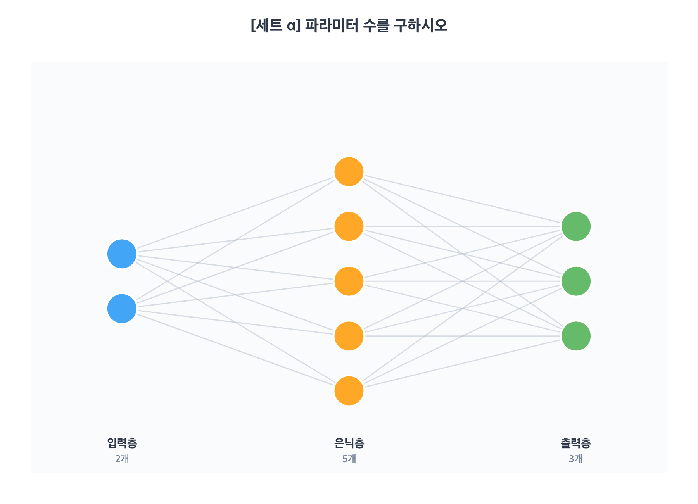 입력2→은닉5→출력3 | (2×5+5)+(5×3+3)=**28개** |
| B-9 | 파리=[4,2], 프랑스=[3,1], 독일=[3,2] → 파리−프랑스+독일 | **[4,3]** (≈베를린) |

#### 세트 β

| 문항 | 숫자 | 정답 |
|------|------|------|
| B-1 | w₁=1, w₂=1, b=−0.5, 입력(1,1) | 가중합=1.5, 출력=**1** |
| B-2 | y=4x+1, z=2y+3 | z=8x+5 (1차식) |
| B-3 | 예측[1,4,7], 실제[2,4,5] | MSE=(1+0+4)/3≈**1.67** |
| B-4 | 예측[1,4,7], 실제[2,4,**19**] (이상치) | MSE=(1+0+144)/3≈**48.33** |
| B-5 | w=5, grad=−2, lr=0.1 | w_new=5+0.2=**5.2** |
| B-6 | w=6, grad=4, lr=0.1/0.5/2.0 | 5.6/4.0/**−2.0** |
| B-7 | x=[1,2], w=[1,−0.5], b=−0.5, ReLU | z=1−1+(−0.5)=−0.5, ReLU=**0** |
| B-8 | 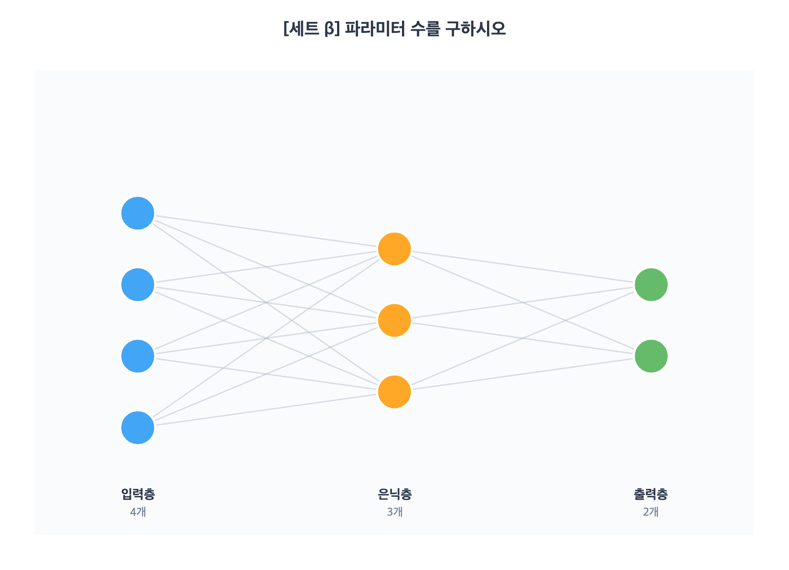 입력4→은닉3→출력2 | (4×3+3)+(3×2+2)=**23개** |
| B-9 | 도쿄=[5,3], 일본=[4,2], 한국=[4,1] → 도쿄−일본+한국 | **[5,2]** (≈서울) |

#### 세트 γ

| 문항 | 숫자 | 정답 |
|------|------|------|
| B-1 | w₁=1, w₂=1, b=−1.5, 입력(1,1) | 가중합=0.5, 출력=**1** |
| B-2 | y=2x+3, z=3y+2 | z=6x+11 (1차식) |
| B-3 | 예측[3,6,9], 실제[5,6,7] | MSE=(4+0+4)/3≈**2.67** |
| B-4 | 예측[3,6,9], 실제[5,6,**25**] (이상치) | MSE=(4+0+256)/3≈**86.67** |
| B-5 | w=2, grad=10, lr=0.05 | w_new=2−0.5=**1.5** |
| B-6 | w=10, grad=−4, lr=0.1/0.5/2.0 | 10.4/12.0/**18.0** |
| B-7 | x=[2,3], w=[1,−1], b=1, ReLU | z=2−3+1=0, ReLU=**0** |
| B-8 | 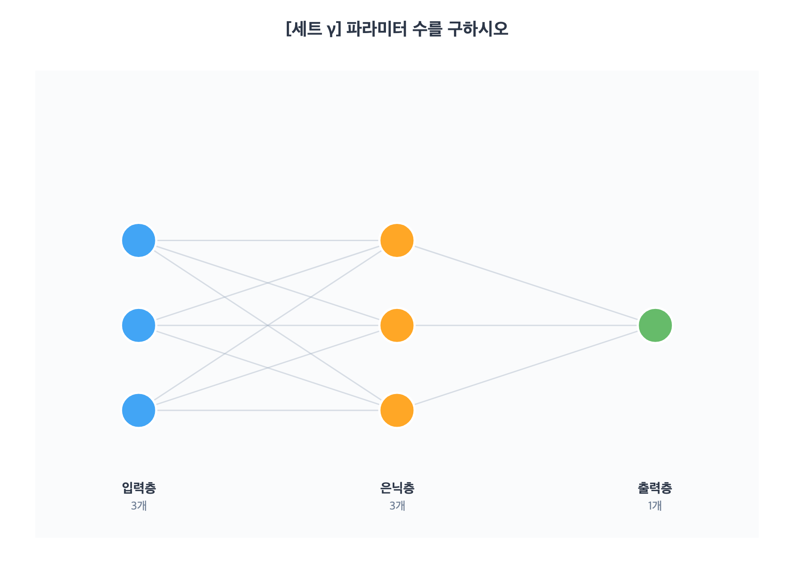 입력3→은닉3→출력1 | (3×3+3)+(3×1+1)=**16개** |
| B-9 | 런던=[2,4], 영국=[1,3], 프랑스=[1,2] → 런던−영국+프랑스 | **[2,3]** (≈파리) |

---

### 9.5 테마별 배점 산출표 (교사용)

각 학생의 테마별 성취도를 산출하여 피드백에 활용합니다.

| 테마 | 해당 문항 | 만점 |
|------|-----------|:----:|
| CT (비판적 사고) | D-1, D-4(부분), C-4, E-2, F-1, F-2 | 약 20% |
| CO (개념 이해) | A-1~A-6, A-9, A-10, C-1, C-5, D-2, D-3, D-6 | 약 30% |
| AL (알고리즘) | A-7, A-8, C-2, D-5, E-1, C-3(부분) | 약 20% |
| MA (수학적 이해) | B-1~B-9, C-3(부분), C-5(부분) | 약 30% |
